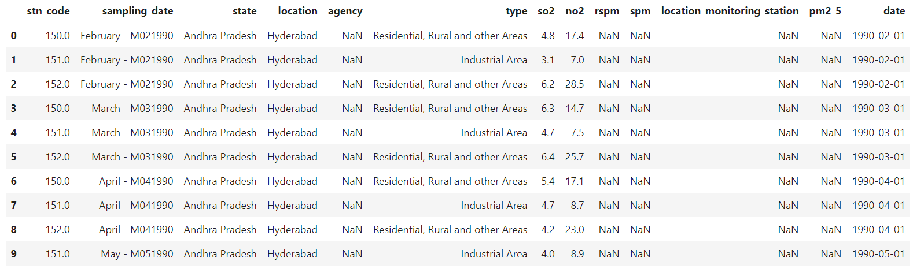
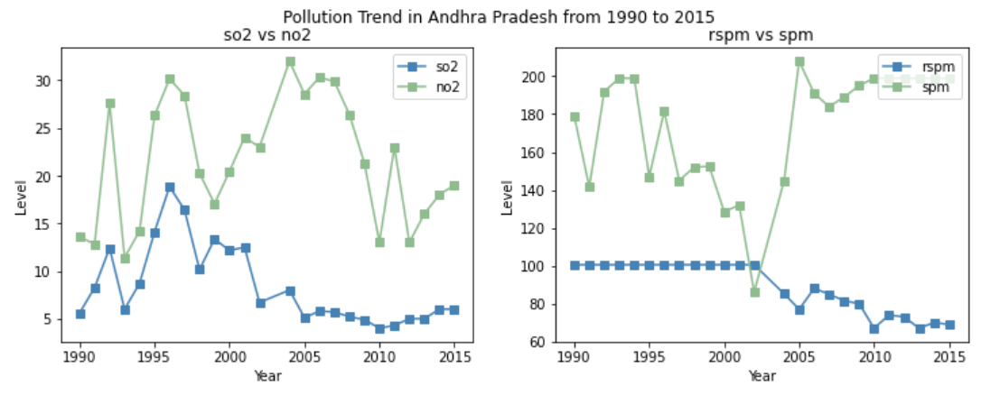

# 6070-CA01-Exploratory Data Analysis on India Pollution Data with Python
## Data: 
> The dataset consists of India's pollution data from 1990 to 2015.

> The insturction for the tasks can be found [here](CA01_EDA_India_Pollution_Instructions.pdf)  
> The the python notebook can be found [here](CA01_Oliver_Lin.ipynb)
## Exploratory Analysis:
> In this analysis, we look into some basic info about the dataset such as the columns, missing values, shapes etc.  
>  
> Then, we clean the data by dropping some irrelevant columns, making sure categorical data is consistent, and add in a year column.  
>  
> For the missing values, we use the Imputer from sklearn.preprocessing to fill in those missing values in every column with the mean.  
>  
> Final, we make a few bar charts and line plot to visualize the pollution level and trends over the years.  
> Here is a sneak peak of the visualization of the pollution trend:\
> 
